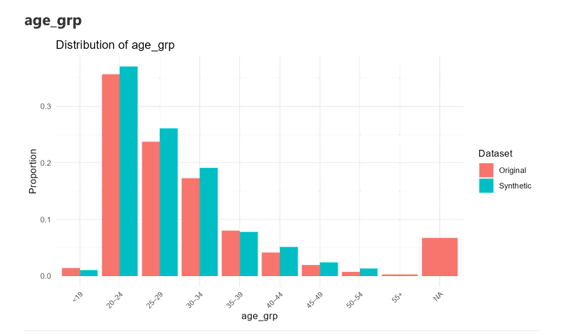
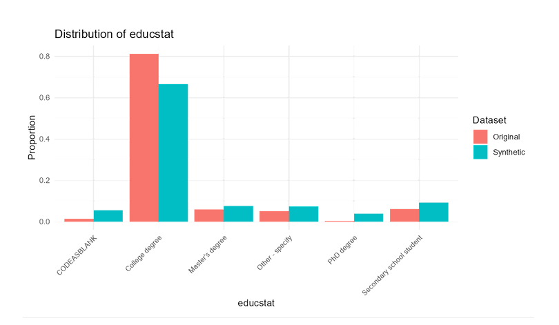
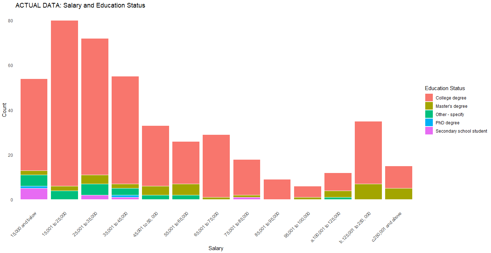
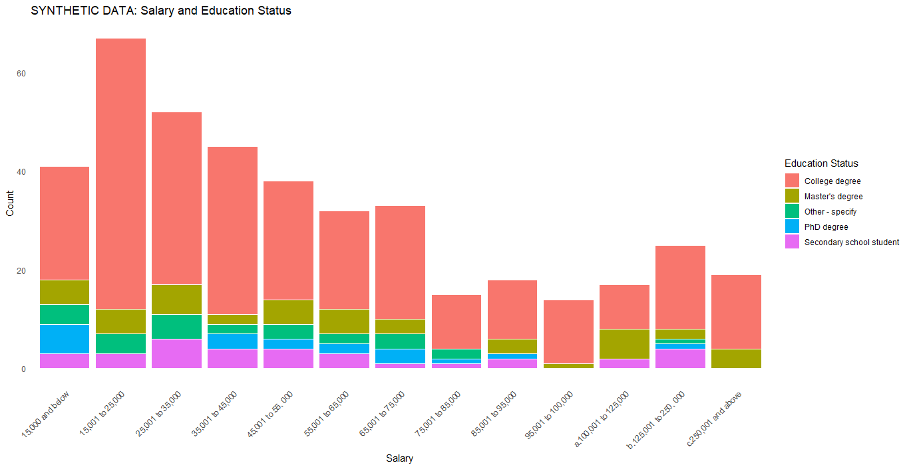
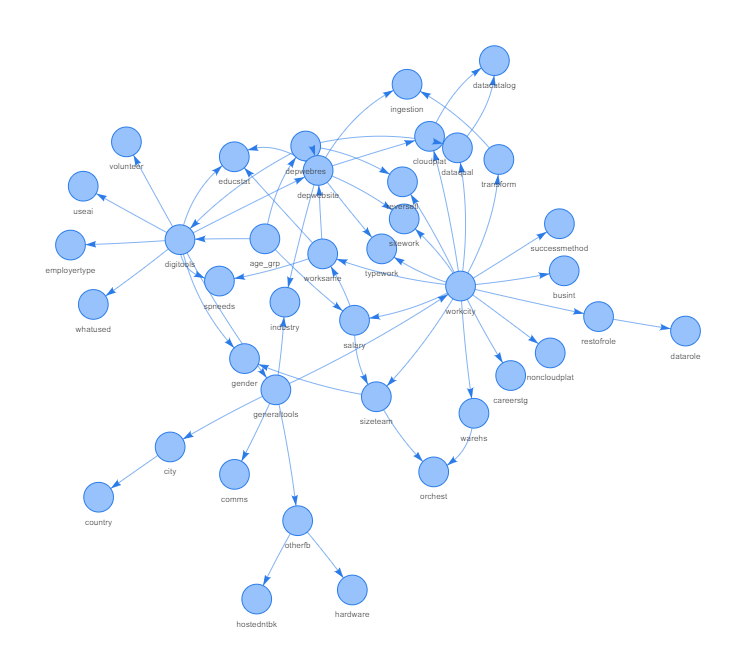

# Synthetic Data Generation & Validation Using R's bnlearn Package 

## Objective  
Turn sensitive survey responses into **privacy‑safe synthetic datasets** while keeping the statistical patterns intact.  
The goal: allow analysis, sharing, and portfolio demonstration **without exposing any respondent’s real data**.

---

## Action from Results  
- Share the synthetic dataset outputs publicly without any privacy risk.
- Add to workflow for the next wave of surveys in the Data Engineering Pilipinas group.
  
---

## Findings  
- Comparable distributions per column: based on **Side‑by‑side frequency distribution plots** for every column, comparing original vs synthetic data
- 
- 
- Click here to see all the plots. [Distribution Plots of Original and Synthetic Data]([original_n774_vs_synthetic_deduped_n743.pdf))
- **Salary vs. education stacked bar plots** indicate slight deviations from original dataset. This is expected based on the algorithm.
- 
- 
---

## Background  
- Raw survey data often contains **personally identifiable or sensitive information** (e.g., salary).  
- Directly sharing it — even internally — can breach trust or compliance rules.  
- This workflow uses a **Bayesian network approach** (`bnlearn` in R) to model relationships between variables, then generates synthetic records that mimic the original dataset’s structure and distributions.  As an added step, rows from synthetic dataset matching the rows from the original dataset are dropped.
- You can read more about bnlearn here: [bnlearn documentation](https://www.bnlearn.com/documentation/)

---

## Workflow: 
- [Click here to see workflow for generating the synthetic dataset](workflow_bnlearn.txt)  
- [Click here to see workflow for generating the plots](workflow_plots.txt)
1. **Load & Preprocess**  
   - Read raw survey CSV, already cleaned of identifiers.  
   - Create an `age_grp` factor from numeric age.  
   - Remove non‑modeling columns.  
   - Normalize text encoding and replace blanks with `"CODEASBLANK"`.  
   - Convert all variables to factors for modeling consistency.

2. **Model & Synthesize**  
   - Learn Bayesian network structure via **Hill‑Climbing**. Below is the resulting network. 
   - Fit conditional probability tables.
   - Set target duplication = 20.  Set max iterations = 2000. Start loop.
   - Generate synthetic datasets with the same number of rows as the original dataset.
   - Check if duplicate count is = 20. If > 20, loop back to generation step. Stop if met.
   - If duplicate count = 20, save seed, and save synthetic dataset. 

3. **Audit for Privacy**  
   - Tag datasets as `real` or `synthetic`.  
   - Combine and check for **exact record matches** across all factor combinations.
   - Export duplication check containing synthetic rows for deletion in a csv file.
   - **Drop row_ids of synthetic dataset** identified as similar to original dataset.
   - Export both original df and cleaned synthetic df for frequency distribution plots.

4. **Frequency Distributions**  
   - Compute per‑variable counts and proportions for both real and synthetic datasets.  
   - Combine into a single table for plotting.
   - Export combined long table of frequencies as csv.

5. **Visualization & Export**  
   - Loop through all variables, generating **side‑by‑side bar plots** (Original vs Synthetic).  
   - Save plots as PNGs and embed in an **HTML report** for easy review.
   - Quick check: Salary vs. Educational status stacked bar plots to identify areas for manual editing.

---
